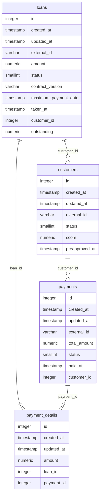

# MO Backend Technical Test

## Introduction
MO Loans is a API for handle and supervise customer's loans and payments.

### Entity-relationship model


## How run the project in development
You have 2 options to run the project:
- Using Docker. (You must have docker-compose installed)
- Using your local machine

### Using Docker
1. Build the services `docker-compose build`
2. Up the services `docker-compose up`

### Using your local machine
1. Create a virtual environment `python3 -m venv .venv`
2. Activates the virtual environment created ``
3. Install all the dependencies `pip install -r dev-requirements.txt` 
3. Set the environment variables into a setting.ini file
```ini
[settings]
SECRET_KEY={{ SECRET_KEY }} 
DEBUG={{ True || False }}
DATABASE_NAME={{ DATABASE_NAME }}
DATABASE_USER={{ DATABASE_USER }}
DATABASE_PASSWORD={{ DATABASE_PASSWORD }}
DATABASE_HOST={{ DATABASE_HOST }}
DATABASE_PORT={{ DATABASE_PORT }}
```
4. Run the migrations `python3 manage.py migrate`
5. Run the server `python3 manage.py runserver`

## How aport to the project
- Use conventional commits. [Learn it. here](https://www.conventionalcommits.org/en/v1.0.0/#summary)
- Use Ship / Show / Ask [Learn it. here](https://martinfowler.com/articles/ship-show-ask.html)
- Use PEP8 for Python code.

### Endpoints
- GET: /api/customers/
- POST: /api/customers/
- POST: /api/customers/bulk
- GET: /api/customers/balance
- GET: /api/customers/{customer_id}/loans
- GET: /api/customers/{customer_id}/payments
- POST: /api/loans
- GET: /api/loans
- POST: /api/payments
- GET: /api/payments
