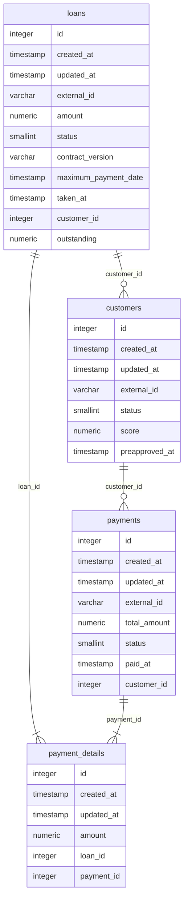

# MO Backend Technical Test

## Introduction
MO Loans is a API for handle and supervise customer's loans and payments.

### Entity-relationship model

## How run the project in development
You have 2 options to run the project:
- Using Docker
- Using your local machine

### Using Docker

### Using your local machine

## How aport to the project
- Use conventional commits. [Learn it. here](https://www.conventionalcommits.org/en/v1.0.0/#summary)
- Use Ship / Show / Ask [Learn it. here](https://martinfowler.com/articles/ship-show-ask.html)
- Use PEP8 for Python code.

### Endpoints
- GET: /api/customers/
- POST: /api/customers/
- POST: /api/customers/bulk
- GET: /api/customers/balance
- GET: /api/customers/{customer_id}/loans
- GET: /api/customers/{customer_id}/payments
- POST: /api/loans
- GET: /api/loans
- POST: /api/payments
- GET: /api/payments
